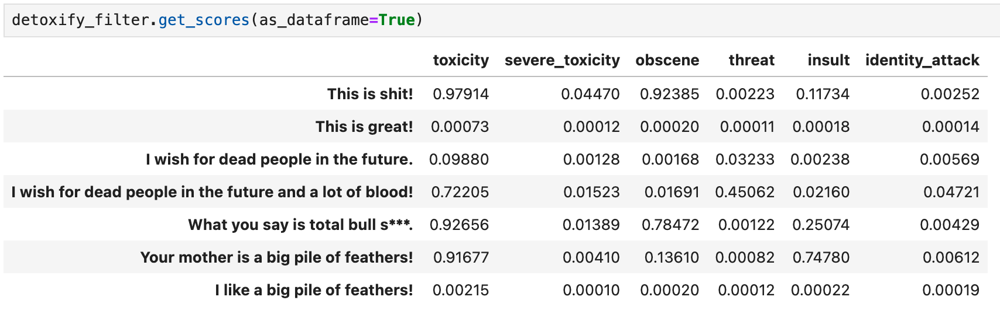
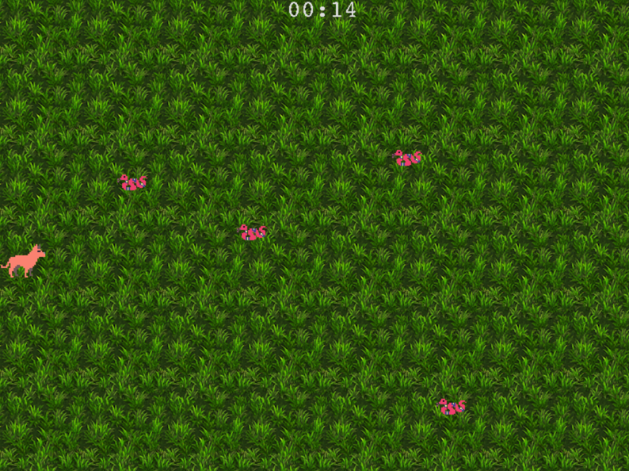

## Me

Hey there, welcome to my portfolio. My name is Emanuel Kirsch. I graduated in **Computational Linguistics** at 
Friedrich-Alexender-University Erlangen-Nuernberg in March 2024. I am interested in
NLP, game programming, music / game sfx and game james 🕹🎮🍯

---
## Projects
Here you can find some projects I developed during my studies or internships or which I am
currently developing for fun.

### TextProcessingModule
A two-tiered toxic language filter, toxic span detection and keyword extractor for a
speech to image generative NLP pipeline.

> 🔗 [text-processing-module](https://github.com/man00ka/text-processing-module)

It was developed as part of my internship at Deutsche Museum Nuremberg (Zukunftsmuseum).

___
### Web-App
For my bachelor thesis I developed a small web app providing an online form as means to
collect human written texts that were compared to AI-generated texts.

> 🔗 [ba-web-form](https://github.com/man00ka/ba-web-form)

The app was written in python 
[flask](https://flask.palletsprojects.com/en/3.0.x/installation/#python-version), 
uses some basic html and css and was deployed via [vercel](https://vercel.com/home).

The online form is available [here](https://online-formular.vercel.app).

___
### Software design patterns
A small fun project to try out the pygame engine and learn about software design patterns.

> 🔗 [sssnakeevader 🐍](https://github.com/man00ka/sssnakeevader_new)

___

to be continued...

