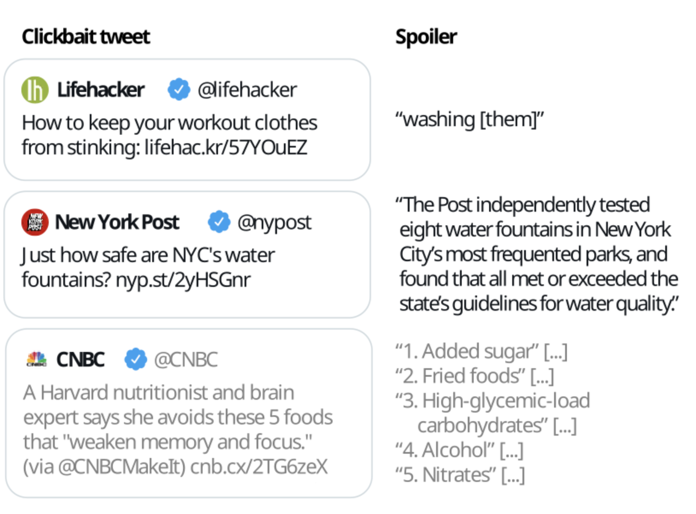

# Pre-Processing – SemEval23
This is a longer and rough code snippet for converting and pre-processing training and evaluation data from a 
SemEval 2023 task so the data fits the fine-tuning process of a DistilBert model for question answering
as described [here](https://huggingface.co/learn/nlp-course/chapter7/7?fw=pt#question-answering)
on huggingface.com.

## Motivation
The code was used as a pre-processing step to solve the [SemEval 2023 task](https://pan.webis.de/semeval23/pan23-web/clickbait-challenge.html)
of **clickbait spoiling**.



The overall idea was to model this as **question answering (QA) task**, where the QA model would receive the content
of a tweet as question, visit the URL in the tweet and extract candidate answer spans from the sites content.
___
## Code

```python
import numpy as np

## VARIABLEN ##
max_length = 384
stride = 128


## FUNKTIONEN ##
# START rename_and_restructure ------------>
def rename_and_restructure(examples):
    """ 
    Renames 
        'uuid' to 'id',
        'postText' to 'question'
        'targetParagraphs' to 'context',
        'spoiler' to 'answers'
    and converts 'answers' from i.e. ['2070'] to {'text': ['2070'], 'answer_start': [0]}
    and 'context' from being a list of paragraphs to being one consecutiv string.
    
    This method is ment to be used with the map() function of the datasets.DataSet() class.
    """
    
    def convert_answer_starts(examples):
        start_positions = []

        for idx in range(len(examples['targetParagraphs'])):
            paragraphs = examples["targetParagraphs"][idx]
            answer_positions = examples["spoilerPositions"][idx]

            # Länge aller Absätze als array speichern:
            paragraphs_lengths = np.array([len(paragraph) for paragraph in paragraphs])

            # Länge des vorherigen Absatzes + 1 (Leerzeichen) = Start-Char des
            # nächsten Absatzes:
            paragraphs_lengths[1:] = paragraphs_lengths[0:-1] + 1
            paragraphs_lengths[0] = 0  # Start-Char für 1.Absatz = 0

            # Kumulative Summe bilden:
            paragraphs_lengths = paragraphs_lengths.cumsum()

            # answer start:
            answer_starts = []
            for position in answer_positions:
                answer_start_paragraph = position[0][0]
                answer_start_char = position[0][1]
                answer_start = paragraphs_lengths[answer_start_paragraph]+answer_start_char
                answer_starts += [answer_start]

            start_positions += [answer_starts]
            
            # # answer stop:
            # answer_stop_paragraph = answer_position[0][1][0]  # 1
            # answer_stop_char = answer_position[0][1][1]  # 24
            # answer_stop = paragraphs_lengths[answer_stop_paragraph]+answer_stop_char
            
            # # answer span:
            # answer_span = (answer_start, answer_stop)

        return start_positions
    
    
    convertion = {}
    
    # Convert 'spoiler':
    convertion["id"] = examples['uuid']
    convertion["question"] = [post[0] for post in examples['postText']]
    convertion['context'] = [" ".join([paragraph.strip() for paragraph in post]) for 
                             post in examples['targetParagraphs']]

    # convert 'spoiler' from i.e. ['2070'] to an answer
    # like {'text': ['2070'], 'answer_start': [0]}: 
    all_answer_starts = convert_answer_starts(examples)
    all_answers = []
    for idx in range(0,len(examples['spoiler'])):
        spoilers = examples['spoiler'][idx]
        answer_starts = all_answer_starts[idx]
        
        answers = []
        for idx2 in range(len(spoilers)):
            answer = {"text": [spoilers[idx2]], 
                      "answer_start": [answer_starts[idx2]]}
            answers += [answer]
            
        # Add either a list of answers or a single answer
        # {'text': <answer_text>, 'answer_start': <answer_start>} if there 
        # is only one answer for the current example:
        all_answers += [answers]
        
    convertion['answers'] = all_answers
    
    return convertion
# <------------ END rename_and_restructure

# All of the following was taken from 
# https://huggingface.co/learn/nlp-course/chapter7/7?fw=pt#question-answering
# and slightly modified.
def preprocess_training_examples(examples, tokenizer):
    questions = [q.strip() for q in examples["question"]]
    contexts = [c.strip() for c in examples["context"]]
        
    inputs = tokenizer(
        questions,
        contexts,
        max_length=max_length,
        truncation="only_second",
        stride=stride,
        return_overflowing_tokens=True,
        return_offsets_mapping=True,
        padding="max_length",
    )

    offset_mapping = inputs.pop("offset_mapping")
    sample_map = inputs.pop("overflow_to_sample_mapping")
    answers = examples["answers"]
    
    start_positions = []
    end_positions = []

    for i, offset in enumerate(offset_mapping):
        sample_idx = sample_map[i]
        answer = answers[sample_idx][0]   # this only works for single answer questions!
        start_char = answer["answer_start"][0]
        end_char = answer["answer_start"][0] + len(answer["text"][0])
        sequence_ids = inputs.sequence_ids(i)

        # Find the start and end of the context
        idx = 0
        while sequence_ids[idx] != 1:
            idx += 1
        context_start = idx
        while sequence_ids[idx] == 1:
            idx += 1
        context_end = idx - 1

        # If the answer is not fully inside the context, label is (0, 0)
        if offset[context_start][0] > start_char or offset[context_end][1] < end_char:
            start_positions.append(0)
            end_positions.append(0)
        else:
            # Otherwise it's the start and end token positions
            idx = context_start
            while idx <= context_end and offset[idx][0] <= start_char:
                idx += 1
            start_positions.append(idx - 1)

            idx = context_end
            while idx >= context_start and offset[idx][1] >= end_char:
                idx -= 1
            end_positions.append(idx + 1)

    inputs["start_positions"] = start_positions
    inputs["end_positions"] = end_positions
    return inputs


#############################
def preprocess_training_examples_squad(examples, tokenizer):
    questions = [q.strip() for q in examples["question"]]
    contexts = [c.strip() for c in examples["context"]]
        
    inputs = tokenizer(
        questions,
        contexts,
        max_length=max_length,
        truncation="only_second",
        stride=stride,
        return_overflowing_tokens=True,
        return_offsets_mapping=True,
        padding="max_length",
    )

    offset_mapping = inputs.pop("offset_mapping")
    sample_map = inputs.pop("overflow_to_sample_mapping")
    answers = examples["answers"]
    
    start_positions = []
    end_positions = []

    for i, offset in enumerate(offset_mapping):
        sample_idx = sample_map[i]
        answer = answers[sample_idx]
        start_char = answer["answer_start"][0]
        end_char = answer["answer_start"][0] + len(answer["text"][0])
        sequence_ids = inputs.sequence_ids(i)

        # Find the start and end of the context
        idx = 0
        while sequence_ids[idx] != 1:
            idx += 1
        context_start = idx
        while sequence_ids[idx] == 1:
            idx += 1
        context_end = idx - 1

        # If the answer is not fully inside the context, label is (0, 0)
        if offset[context_start][0] > start_char or offset[context_end][1] < end_char:
            start_positions.append(0)
            end_positions.append(0)
        else:
            # Otherwise it's the start and end token positions
            idx = context_start
            while idx <= context_end and offset[idx][0] <= start_char:
                idx += 1
            start_positions.append(idx - 1)

            idx = context_end
            while idx >= context_start and offset[idx][1] >= end_char:
                idx -= 1
            end_positions.append(idx + 1)

    inputs["start_positions"] = start_positions
    inputs["end_positions"] = end_positions
    return inputs


def preprocess_validation_examples(examples, tokenizer):
    questions = [q[0].strip() for q in examples["question"]]
    contexts = [c.strip() for c in examples["context"]]
        
    inputs = tokenizer(
        questions,
        contexts,
        max_length=max_length,
        truncation="only_second",
        stride=stride,
        return_overflowing_tokens=True,
        return_offsets_mapping=True,
        padding="max_length",
    )

    sample_map = inputs.pop("overflow_to_sample_mapping")
    example_ids = []

    for i in range(len(inputs["input_ids"])):
        sample_idx = sample_map[i]
        example_ids.append(examples["id"][sample_idx])

        sequence_ids = inputs.sequence_ids(i)
        offset = inputs["offset_mapping"][i]
        inputs["offset_mapping"][i] = [
            o if sequence_ids[k] == 1 else None for k, o in enumerate(offset)
        ]

    inputs["example_id"] = example_ids
    return inputs
```